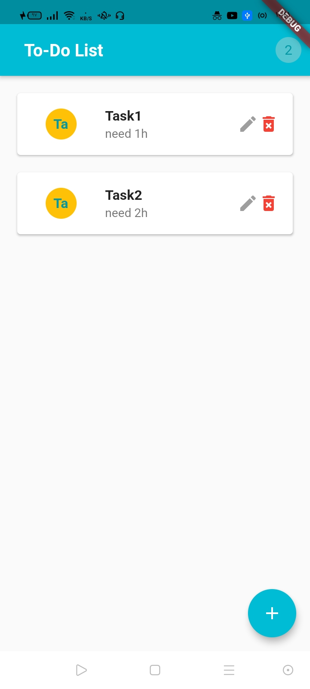
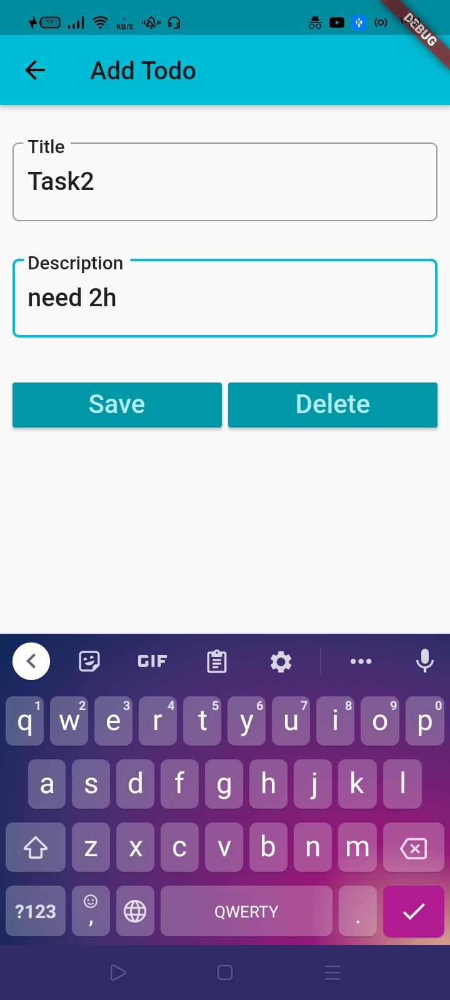

# To-Do App

all code on master branch not on main branch.


A TODO App : It is a simple app for management time, the user can add daily tasks and it is description , user can mark task as done when the task completed. There are a counter for the uncompleted task appear on the top of app(inside appBar), also the user can edit, delete a specific task. the tasks info stored on a locally database by using SQLite DB.


## Downloading Source Code

To clone the current master (development version):

```

$ https://github.com/latifaIssa/To-Do.git
$ git checkout master

```

## Technologies

the application is created with:

- Dart

- Flutter

- SQLite DB

## Application structure

- Models
   contain the todo class
- Screens
   contain pages of my app(todo_list and todo detailes page)
- Utils
   contain database setting and functions

## App Screens

                       



